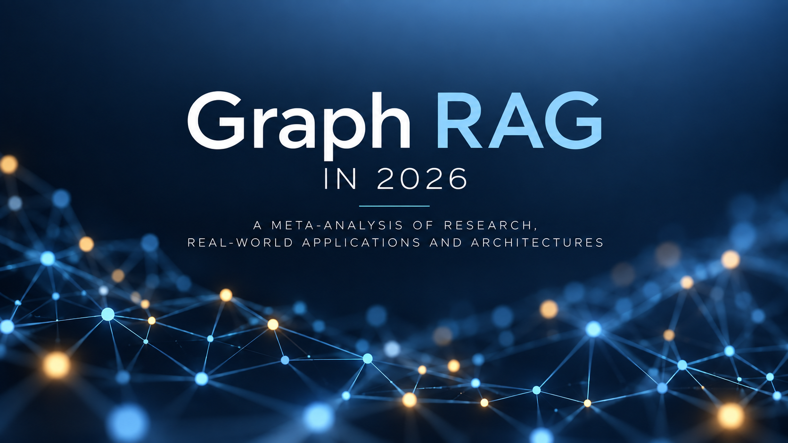
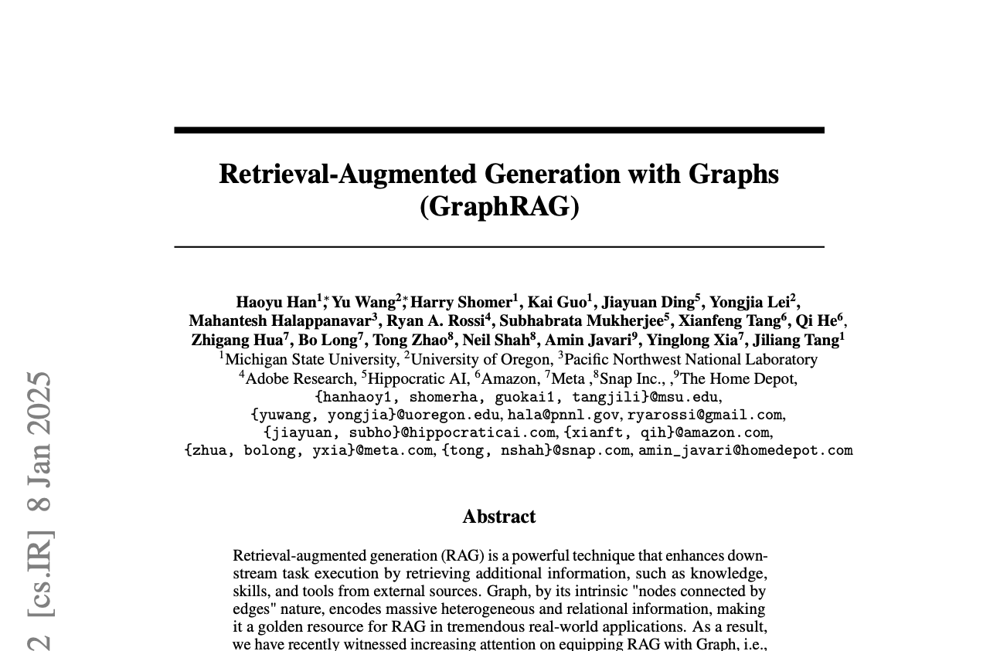
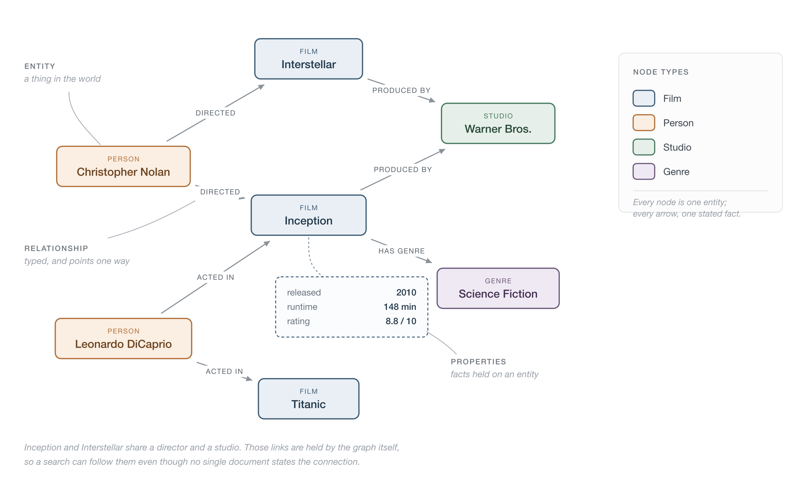
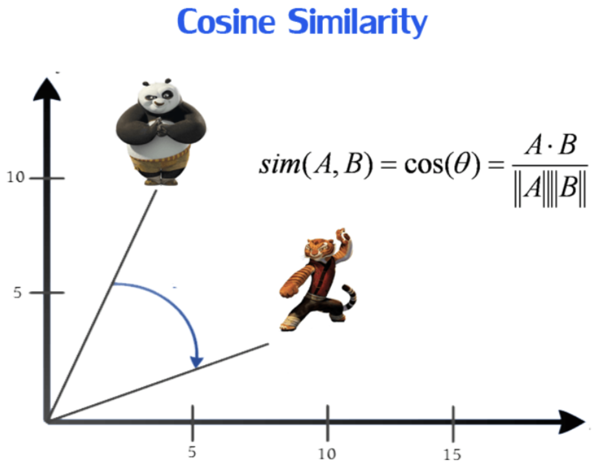
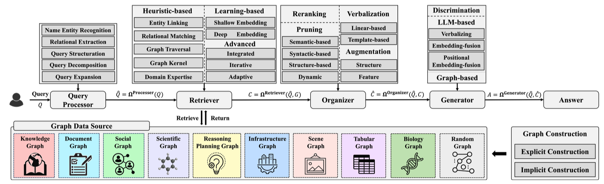
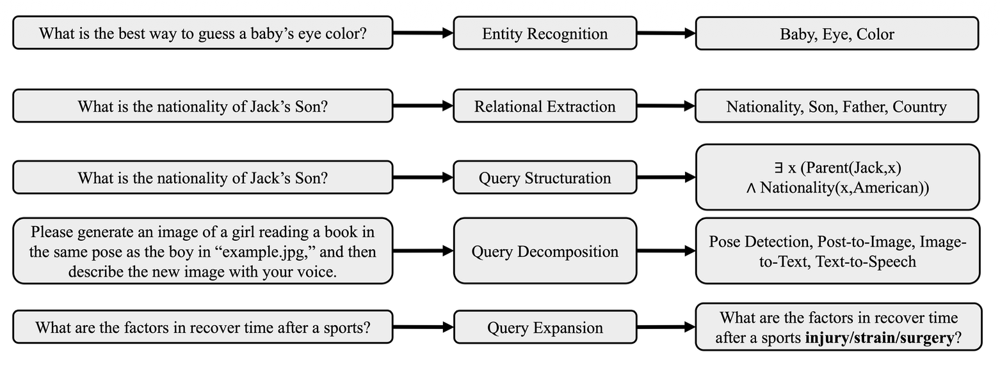
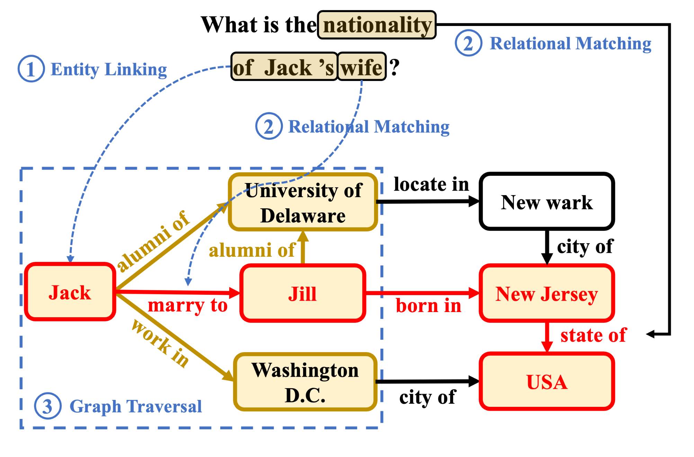
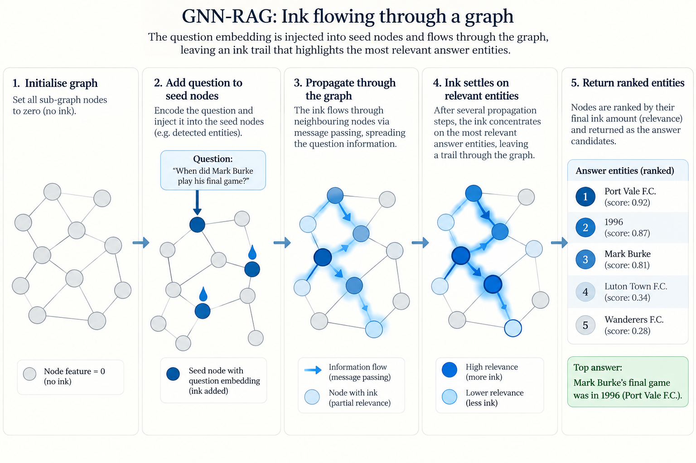

# Graph RAG

Graph RAG follows a multistep process taken from 53 page meta-analysis  [@han2025retrievalaugmentedgenerationgraphsgraphrag].




## Representations



### Triples, Property Graph vs Tensor

- **RDF Triples** `(PaymentsAPI, ownedBy, PaymentsTeam)` nodes and edges are represented as **subject-relationship-object** triples
- **Labelled Property Graph** Neo4j is an example, nodes and relationships can contain multiple properties, which are very useful for searching over
- **GNN Graph** `x`,`edge_index`, `edge_attr` - a numerical representation optimised for ML

## Previous spike

- **Query processor** - The LLM had access to a schema tool, so it had the schema of a graph (in Cypher) and an MCP server for making queries.  Based on the schema it converted the query into a Cypher query (**Query Structuration**) to get the appropriate responses from the graph to answer its question. All the heavy lifting was done by the prompt and the Query -> Cypher translation
- **Retriever** - An MCP server did a raw Cypher request to the graph and returned the
- **Graph Data Source** - Neo4J database
- **Organiser** - The prompt turned the Cypher response back into a human-readable answer, as well as returning the context


**Results** - It performed very well with single hop queries, queries that required aggregation.  Responses were much more deterministic than with the RAG agent.
**But**, it struggled when answers were more than one or two hops.  The point of this research is to see what options we have for an engine that is
able to return accurate results a more than one hop.

### Examples of 1–2 Hop Knowledge Graph Paths

1. **Person → Company**  
   `Alice` → **works_at** → `Google`  
   *1 hop*

2. **Person → City**  
   `Bob` → **lives_in** → `London`  
   *1 hop*

3. **Person → Company → City**  
   `Alice` → **works_at** → `Google` → **headquartered_in** → `Mountain View`  
   *2 hops*

4. **Drug → Disease → Symptom**  
   `Metformin` → **treats** → `Type 2 Diabetes` → **has_symptom** → `Fatigue`  
   *2 hops*

5. **Developer → API → Service**  
   `Developer` → **uses** → `Payments API` → **connects_to** → `Payment Service`  
   *2 hops*

## Background Information

### Heuristics vs Semantics

**Heuristics** - Uses traditional rules, practical rule of thumb, clues.  For example, word clues, if we are looking for 
a book on gardening, we go to the gardening section, look for books with gardening in the title, check for books next
to the gardening book, look for books written by Alan Titchmarsh or Monty Don.  Fuzzy searches would fit into this
field

**Semantics** - Based on meaning, we first understand the meaning behind the sentence and then approach the problem that 
way.  For example if someone says ''I'm going to get a sandwich'', we can probably ascertain that they are hungry.
Within the context of Artificial Intelligence and ML, when we are talking about semantics, we are probably likely to use
embeddings and mechanisms such as cosine similarity.  Embeddings are able to capture the meaning of a phrase rather than
the just the raw shape of the words.




```mermaid                                                                                                                                                                                                                         
 sequenceDiagram                                                                                                                                                                                                                    
     participant User                                                                                                                                                                                                      
     participant Processor
     participant Retriever
     participant GraphDataSource
     participant Organizer
     participant Generator
     
     User ->> Processor: Query
     Processor ->> Processor: Process Query
     Processor ->> Retriever: Pre-Processed Query
     Retriever ->> GraphDataSource: Retrieve Content
     GraphDataSource -->> Retriever: Content
     Retriever ->> Organizer: Content
     Organizer ->> Generator: Arranged and refined content
     Processor ->> Generator: Pre-processed query
     Generator ->> User: Generated answer

```



## Query Processor

You start with a query, then the pipeline goes through a first stage where it formulates the query.

There are a number of different approaches for how the query can be formulated:

- entity recognition
- relational extraction
- query structuration
- query decomposition
- query expansion



### Entity Recognition

Can use an LLM, or some other deep learning model to extract named entities (nouns that belong to predefined categories)

### Relational Extraction

Identify a relation, such as 'capital of' from a query such as 'What is the capital of China?' then uses a vector similarity
search to find corresponding edges.  

### Query Structuration

This is what we did. Converting a query into Cypher, SQL, SPARQL.

### Query Decomposition

For extra long queries break down into sub queries/sub-tasks

### Query Expansion

Perform graph retrieval to expand the query, so it can then be used against a naïve RAG retriever

## Retriever



### Heuristic-based (Rule) Retriever

A retriever can use one or a combination of these techniques.

#### Entity Linking

We find entities within the query and map them to corresponding **seed** nodes in the graph.  This can be the retriever or can be the foundation for further graph traversal.
Accurate entity recognition can be conducted using Top-K nodes computed through vector embeddings and lexical features. 
For more niche queries additional context can be augmented by an LLM at the query stage (adding extra descriptive text)

#### Relational Matching

Identify edges (relationships) within a graph that correlate to relations in the query.  Especially valuable for problems that focus on finding relationships between entities.

#### Graph Traversal

BFS and DFS are performed on the graph to get query information: extract all paths up to length $l$ between
entity linked nodes (e.g. entity1 -> [$e_1 \dots e_{l - 1}$] -> entity2), or an $l$-hop subgraph around the
initial entities.

**Paths** - A *join* operation. Works if there are two or more seed nodes, fails if there is only one.
Prunes everything in the $l$-hop subgraph that is not on the path between those seed entities.

**$l$-hop subgraph** - A ball, a full scoop of everything around the seed nodes, nothing is disregarded.
This is the fallback when entity linking yields a single seed.

**Both, not either-or** - A retriever would normally have both: a subgraph if extracted entities are equal
to 1, paths if they are greater. Either way the result is then pruned (top-k relevance, cross-encoder
rerank, LLM-as-a-pruner) or fed into a GNN to give candidate answers.

> The consensus is that two hops is the ideal — as the number of hops grows beyond that, accuracy dramatically declines.

##### Pruning

**Top-K Relevance** 

Using an LM that calculates probabilities calculate the probability of the node being relevant to the answer.

**Cross-encoder Rerank**

Use a model specifically built for ranking (e.g. `bge-reranker-large).
Score the reasoning chain/path such as ``Ian Rush →PLAYED_FOR→ Liverpool →COMPETES_IN→ Premier League'' for a question such
``Where did Ian Rush play and in which league does that team play in?''.
In `HyKGE` the scoring is not performed against the question, the LLM provides a hypothesis for an answer, the entities are
extracted from the hypothesis and then the result is chunked.  This is compared against the reasoning chains.

**LLM as a pruner**

- **Post-hoc** - Give all the triples to an LLM and prompt the LLM to rank the triples in terms of relevance to the prompt.  The top-K are kept.
One call per LLM query.
- **Inline steering** - during traversal the LLM can choose whether to continue, or what to drop.  
It prunes as it goes, keeps track where the results are and decides whether to continue.  The cost for this though is unbounded. 

### Learning Based Retrieval

There are two forms of embedding, shallow and deep.  We're going to focus on deep embeddings.

**GNN-RAG** - An upcoming architecture, published for a conference in 2025 and becoming popular.  Needs to be
pre-trained on a set of questions and answers (these can be produced synthetically from the graph & an LLM).
The maximum number of hops it can comfortably retrieve is three.

**How the GNN learns** - It trains paths from each node to $l$ hops by sending messages between the nodes.  The
weights of a node are its individual weights merged with weights passed through from neighbours.  Pre-training
needs graph triples from the original graph plus question and node answer pairs.

#### Retrieval steps

Once the graph is trained the retriever takes the following steps:

1. With entity linking find the seed node/s (us)
2. Manually extract a subgraph of $n$-hops from the seed nodes, transforming into KG-triples ($e_{id} \times r \times e_{id}$) (us)
3. Pass the query, seed node id/s, flat list of entity strings (these are usually a text id) and subgraph tuples to the retrieval command (GNN-RAG)
4. Receive a list of entity scores (which nodes the GNN predicts answers the question most accurately) (GNN-RAG)
5. Trace the paths (or shortest paths) to the node to return an explanation - tracing all paths up to $n$-hops then reranking would be the most accurate
6. Output the returned paths as triples to the LLM for context

#### GNN-RAG explanation



GNN-RAG sets all the sub-graph nodes to zeros, then inputs the question embedding into the seed nodes.  Imagine it's like ink being added to the seed nodes.
The ink then traces it's way through the graph, and based on the question finds its way to the most appropriate answer entities.  This leaves a metaphorical
ink trail throughout the GNN network...and returns the entities in order of how relevant they are to the question.

#### Why GNN-RAG over rules

A rule-based/heuristic search walks the graph by matching the words in the question to the labels on the
connections — it only works when the right link happens to sound right.

**Learns your domain** - GNN-RAG learns from past questions and their correct answers which connections
actually lead somewhere useful, even when the wording gives no clue.  You bake domain knowledge into the model
while training, so it discovers routes that are not understandable at face value to the embeddings alone.

**Complete answer sets** - It returns a complete set of answers rather than a fixed top few.

**Gets better** - It keeps improving as you collect more examples.  The rule-based version never does.

#### Learning Based Retrieval vs purely Heuristics

In every system some level of heuristics is needed, but learning based retrieval will take the subgraph generated from that step and predict a likely destination node (or nodes)
based on its prior training.  There is an added cost to this, that you need create labelled data - questions and answers and train a dataset.  Based on the table below, you can
see with supervised training (EmbedKGQA, NSM and UniKGQA) with GNNs hugely outperform untrained LLM retrieval when you get to three hops.

| Method                  | WebQSP | MQA 1-hop | MQA 2-hop | MQA 3-hop |
|-------------------------|--------|-----------|-----------|-----------|
| ChatGPT, no KG          | 61.2   | 61.9      | 31.0      | 43.2      |
| + StructGPT (zero-shot) | 72.6   | 94.2      | 93.9      | 80.2      |
| + StructGPT (few-shot)  | 69.6   | 97.1      | 97.3      | 87.0      |
| KV-Mem                  | 46.7   | 96.2      | 82.7      | 48.9      |
| GraftNet                | 66.4   | 97.0      | 94.8      | 77.7      |
| EmbedKGQA               | 66.6   | 97.5      | 98.8      | 94.8      |
| NSM                     | 68.7   | 97.1      | 99.9      | 98.9      |
| UniKGQA (supervised)    | 75.1   | 97.5      | 99.0      | 99.1      |


### Examples - Methodology

#### KG-GPT - Relational matching

1. Query Processor
   1. Sentence segmentation
      1. Break sentence into sub-sentences
      2. For each sub-sentence create a set of entities
2. Retriever
   1. Relational Matching  
      1. Graph lookup to find plausible relations based on the set of entities
      2. LLM pick top-K relations for that sub-sentence
      3. Graph lookup to get all triples with the generated entities and discovered relations
3. Inference
   Input all the triples and the query.

Shortfall, **validation** only.  It only manages to find as many hops as are found in the sub-sentence.  If the answer is two hops away from the entities in the sub-sentence the algorithm will not find them.

## Organiser

The organiser has four main tasks:

- **Graph pruning** - remove noise from the retrieved sub-graphs with 
- **Rerank** the sub-graph context so that the most relevant knowledge it towards to the top (to avoid attention bias)
- **Graph augmentation**
- **Verbalising** the graph while still being structurally aware, this is the mapping layer between graph and prose

### Graph Pruning

**Semantic-based pruning:** Remove semantically irrelevant nodes and edge relationship.  We have already discussed this in part.  Different units can be scored, _node_ score each entity against query, 
_relation_ score relations around each entity, expand chosen ones, _whole subgraph_ partition retrieved subgraph into regions, rank the regions, keep top-k. Some will reconnect disconnected entities.

**Syntactic-based pruning:** a parse tree is created based on query sentence grammar, seed nodes in the graph are scored based on the span distance (distance between words) within the query, then mean neighbourhood aggregation passes the scores
out from the seeds.

**Structure-based pruning:** use the graph structure, for example by calculating the average PageRank score for each path to extract the most relevant entities.  Calculation of -- how reachable is this node from the query's entities?

**Dynamic pruning:** prune as you go, only available for GNNs on a retrieved subgraph - models own attention weights, when below a certain quantity on a retrieved node are pruned.  As the GNN traces the best path to it's predicted target entities,
like with our ink example, this extracts nodes that don't have enough ink.

### Reranker

LLMs tend to give more weight to earlier documents in context than later ones.  Results need to be re-ordered such that the most important documents are higher up.  This can be done with a cross-encoder, a pre-trained model, a GNN etc.

### Graph Augmentation

Once the graph has been retrieved, additional information can be supplied by knowledge within LLMs or external data sources (even by naïve RAG retrievers).  This is need due to the pruning that happens.
There are two main categories:

**Graph Structure Augmentation:** question chunks are augmented to the subgraph as nodes, or the whole question augmented as a single node or a pre-trained diffusion model generates extra edges for the retrieved graph

**Graph Feature Augmentation:** the content of the nodes may be too large or two sparse, so the content can be summarised or generated (or pulled in from a cache)

### Verbalising

Verbalising is the act of turning the retrieved and organised result into something that an LLM can understand.  We previously use the LLM to translate the Cypher response into text as part of the generator prompt
(this was purely a prompt driven action as part of the generation).  The paper discusses a number of mechanisms:

**Linear verbalisation:** These include **Tuple-based**, returning facts as `(entity 1, relation 1, entity 2)` tuples separated by line-breaks.  **Template-based** verbalisations, use predefined templates to generate more
natural sounding text, for example “The {relation} of {entity 1} is/are: {entity 2}”

**Model-based verbalisation:** These include **Graph-to-text verbalisation**, use graph transformers to generate text from KG, or use fine-tuned LLMs to transform graphs into sentences.  **Graph Summarisation** generates concise summaries based
on the retrieved graph and query - directly prompting LLM to summarise facts and query, or fine-tuning an LLM for summarisation.

## Generator

There are many types of generator depending on the actual task, considering we are looking specifically on Question-Answer style RAG, we are likely using a straight GPT or Bedrock model with chat completions to give a response
from the context generated from previous layers of the RAG retrieval process.  That is the generator for GraphRAG doesn't differ from a RAG generator.

## Changes since 2025

| Area | Han et al. baseline | Where the field is moving |
|---|---|---|
| **Graph construction** | KG/document/semantic graphs | Richer heterogeneous and text-attributed graphs |
| **Retrieval** | Traversal, semantic retrieval, KG querying | **Learned graph retrieval, GNN retrieval, hybrid retrieval** |
| **Retrieval unit** | Nodes/triples/paths | **Query-conditioned subgraphs** increasingly important |
| **RAG vs GraphRAG** | GraphRAG generally motivated as an improvement | **GraphRAG is not universally better than vector RAG** |
| **Architecture** | Fairly fixed GraphRAG pipeline | **Adaptive routing: vector RAG ↔ GraphRAG** |
| **Reasoning** | LLM reasons over retrieved graph | Graph retriever itself increasingly participates in reasoning |
| **Agents** | Relatively peripheral | **Agentic GraphRAG** becoming a distinct architecture |
| **Evaluation** | QA benchmark performance | Latency, cost, retrieval quality, generation quality, production usefulness |
| **Context** | Retrieve useful graph information | **Context engineering / pruning becomes central** |
| **Applications** | Mostly research/early systems | Increasingly domain-specific production architectures |

## Where does GraphRAG outperform naïve RAG?

### Corpus level summarisation

If a dataset is large, the answer often doesn't exist in a single chunk, so naïve RAG is unable to find the answer.

### Multi-hop and Relational reasoning

Naïve RAG can struggle to understand relational concepts, such as if David is the Father of Cherry and Elane is the Mother
of David, then Elane is the Grand-mother of Cherry.  Where the LLM needs to be able to accurately give such responses
GraphRAG by far outperforms naïve RAG, due to its built-in multi-hop relational mapping.  

### Domains with relational data

Where data is already relational, flattening to text chunks removes the relational aspect of the data


## Comparison

| Use case                                                     | Naïve RAG | Graph RAG |
|--------------------------------------------------------------|-----------|-----------|
| Quick to set up with AGNO                                    | ✅         | ❌         |
| Flat data structure                                          | ✅         | ❌         |
| Low indexing cost                                            | ✅         | ❌         |
| Single fact lookup where answer exists in a single chunk     | ✅         | ✅         |
| Low tolerance for error                                      | ❌         | ✅         |
| Hierarchical data structure                                  | ❌         | ✅         |
| Needs deep understanding of subject matter                   | ❌         | ✅         |
| Multi-hop and Relational reasoning                           | ❌         | ✅         |
| Questions where aggregation/enumeration/counting is required | ❌         | ✅         |
| Questions where deterministic answers are required           | ❌         | ✅         |
| Explainable retrieval path                                   | ❌         | ✅         |


## Within teams

We trialed building a Graph with OAS specs, then performing validation based on that, it turned out that a lot of the
questions looked at the data as a flat object so graphs were unsuited.  But, on conversation with architect on api assistant
we found the results to be very accurate and deterministic.  We trialed questions where the aggregation and counting was 
required, and the results were excellent.  The API assistant dataset is very relational in nature and a lot of questions
are unanswerable with the current system.  

Initial trial with a pure translation to Cypher layer resulted in excellent results for simple single hop retrieval.  As
the number of hops grew, so the model's ability to propose a retrieval route failed.  This research has shown that retrieval
mechanisms that are more algorithmic in nature are able to overcome this issue by retrieving a larger subgraph and then
pruning and expanding iteratively.

**Proposal:** we spike a more advanced GraphRAG retrieval system that incorporates heuristic traversal up to three hops with a
set goal of getting accurate answers to more complex questions.  We can also test this against the current system and even
experiment with a Graph Neural Network.  
