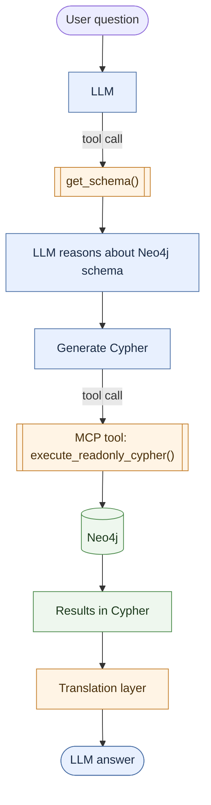

# GraphRAG Intro

This introduction is a review of a survey on GraphRAG [@han2025retrievalaugmentedgenerationgraphsgraphrag].

Traditional RAG which mainly uses semantic/lexical similarity search is built on textual/visual data.  
Textual data is mostly sequential, with words coming after each other.
Visual data is grid-like, with pixels arranged in a fixed structure.  While RAG is able to capture *sounds similar* type
queries, it does not explicitly model relationships or encode heterogeneous information (different types of things). [@han2025retrievalaugmentedgenerationgraphsgraphrag]

## Why?

- Increased accuracy - average response quality/accuracy - 3x higher
- Answer questions that are impossible with vector search
- Once you have the KG easier to develop - as can see explicitly what is going on
- Explainability and governance - how can we audit the responses?

## General GraphRAG framework

```mermaid                                                                                                                                                                                                                         
 sequenceDiagram                                                                                                                                                                                                                    
     participant User                                                                                                                                                                                                      
     participant Processor
     participant Retriever
     participant GraphDataSource
     participant Organizer
     participant Generator
     
     User ->> Processor: Query
     Processor ->> Processor: Process Query
     Processor ->> Retriever: Pre-Processed Query
     Retriever ->> GraphDataSource: Retrieve Content
     GraphDataSource -->> Retriever: Content
     Retriever ->> Organizer: Content
     Organizer ->> Generator: Arranged and refined content
     Processor ->> Generator: Pre-processed query
     Generator ->> User: Generated answer

```

GraphRAG updates the retriever and generator to integrate graph-structured data.
For the retriever Conventional RAG uses encoders for index search, whereas GraphRAG can use
graph traversal methods and graph-based encoders (Graph Neural Networks) to produce embeddings.

We can break down the GraphRAG process into the following components:

- Query Processor
- Graph Data Source
- Retriever
- Organizer
- Generator

and the following elements:

- initial query
- pre-processed query
- graph content
- arranged content

### Query processor

A simple question such as "Who is Justin Bieber's brother?" in knowledge graph terms is
the entity "Justin Bieber" and the relation "brother of".  The query processor's role
is to decompose the question into a format understandable for a knowledge graph.
There are many different techniques to do this, which we will explore.

- entity recognition
- relational extraction
- query structuration
- query decomposition
- query expansion

#### Name entity recognition

LLM (or EntityLinker) extracts entities from the query.  For example in the query:
"What is the best way to guess the colour of the eye of the baby?", "baby", "eye" and 
"colour", which are graph nodes, are extracted.

#### Relational extraction

Extracts the triplet/relationship from the query.  e.g What is the capital of China:

$$?? \xrightarrow{\text{CAPITAL OF}} China$$

The relationship "CAPITAL OF" is extracted.  Vector similarity search can then be used for edges

#### Query structuration

Turning the query into a Graph Query Language request (e.g. Cypher).

#### Query decomposition

Split input query in a number of subqueries, especially when handling complex
tasks that require multistep reasoning and planning.

#### Query expansion

Where user submitted queries are too brief, or ambigous LLMs enrich the queries.
In GraphRAG LLM expansions are augmented with structured relationships - e.g.
using neighboring nodes of the mentioned entities, or converting query to subqueries.

### Retriever

Once the query has been pre-processed, the role of the retriever is to retrieve relevant context from the
GraphDB in order to augment downstream task execution.  GraphRAG retrievers at present are:

- heuristic-based
- learning-based
- domain-specific

#### Heuristic-based Retriever

Predefined rules and domain specific insights are used to extract information from graph data sources.
Uses BFS or DFS (linear time) and goes through the following steps:

**Entity Linking:** map entities identified in the query to nodes in the graph. Top-K nodes are starting points,
based on textual similarity to query.  Computed with vector embeddings and lexical features.  LLMs can be used to 
augment context (by giving a description), for example, where an entity is uncommon in the LLM training data.

**Relational Matching:** like entity linking, but with the goal of matching relationships. Top-K relationships are 
often used.  Heuristic based rules can be better at distinguishing subtle differences, such as byte vs bit and president
vs resident of, than ML based approaches.

**Graph Traversal:** once we have identified initial nodes and edges, graph traversal algorithms can expand this
knowledge...but without overloading irrelevant context.  Limits of set of *l* length between nodes, or *l*-hop subgraphs
around initial nodes are used.  LLMs can be used to prune irrelevant paths.  Pre-defined rules can be used.

**Domain Expertise:** retriever can incorporate domain knowledge

#### Learning-based Retriever

Heuristic based retrievers can struggle to capture concepts with structural or semantic variations, such as "doctor"
and "physician".  Use of embeddings in retrievers can help with this.
There are a number of different graph-based encoders which help with this process:

- shallow embedding methods (e.g. Node2Vec / DeepWalk)
- Deep embedding methods (e.g. Graph Neural Networks GNNs)

**Shallow Embedding Methods:** Node2Vec & Role2Vect learn node, edge and graph embeddings that retrain
essential structural information of the original graph.  In proximity based (Node2Vec & DeepWalk) embeddings, node that 
are close in the graph remain close in the embedding space. Role-based methods, such as Role2Vec generate embeddings
based on their structural role.  Proximity based shallow embeddings can retrieve entities are proximally close, whereas
role based embeddings capture entities that share similar roles.

**Deep Embedding Methods:** Shallow embeddings can struggle to capture semantic features, whereas deep embedding methods
like GNNs are able to jointly fuse structure and node/edge features.

#### Advanced Retrieval

**Integrated Retrieval** combines different types of retrievers to get the best of both worlds.  Examples include
neural-symbolic retrieval and multimodal retrieval.  Neural-symbolic integrates rule-based patterns alongside
neural patterns for abstract/deep patterns.  Different patterns exist:

- Symbolic -\> Neural: Use graph local first, then use neural matching to pick best paths
- Neural -\> Symbolic: Use GNNs to find important nodes, then extract shortest paths
- Hybrid: Do both and combine results.  k-hop neighbourhood, attention with query, collect candidates structurally,
	evaluate them semantically

**Iterative Retrieval** is a multistep process.  For example:

General loop:

1. Start with a query
2. Retrieve initial information
3. Use that info to refine the query 
4. Retrieve more relevant info 
5. Repeat until enough evidence is gathered

**Adaptive Retrieval** in GraphRAG is centred around garnering the correct number of hops to traverse the graph for,
models can be trained to predict required number of hops for a given query.

### Organiser

The organiser received the context from the retriever in the format of entities, relations, triplets, paths or subgraphs.
It then processes this context alongside the pre-processed question.

The data returned from the retriever can often contain much irrelevant and noisy information, this layer does graph
pruning to remove irrelevant knowledge, it is also needed to help reduce context due to attention biases especially
in favour of start and end of context.  With graphs as number of hops increases, context grows exponentially.
Also, graph structured data can be a challenge to consume by LLMs.  

#### Graph Pruning

Removes noise from the retrieved graph.  The following graph pruning methods can be used:

**Semantic-based pruning:** Does this node/edge actually relate to what the query is asking about? removes nodes and 
edges that are semantically irrelevant to the query.  This can be done using LLMs, giving relevance scores/ranking 
relationships, sub-graphs, clusters of nodes, nodes/edges.

**Syntatic-based pruning:** Is this node linguistically close to the important parts of the query sentence? irrelevant 
nodes pruned from a syntatic perspective - e.g. with dependency analysis to generate a parsing tree and utilising span 
distance

**Structure-based pruning:** Based on structure properties, uses page rank to filter out reasoning paths or to extract
most relevant entities

**Dynamic pruning:** Uses attention weights/scores to remove irrelevant nodes during training

#### Reranker

To overcome LLMs' propensity to give more importance to earlier context, results are reranked with the highest ranked
items at the start 

#### Graph Augmentation

The in-memory subgraph is augmented with additional information:

**Graph Structure Augmentation:** Adding new nodes or edges to the graph - such as the query, chunks from
the initial context (turned into a subgraph)

**Graph Feature Augmentation:** Adding additional parameters (features) to nodes to improve context for LLM.
For example content summarisation.

#### Verbalising

Outputting the triples, paths and graphs into natural language to make them easier for the LLM to consume:

- **Tuple-based:** Set of facts (entity 1, relation 1, entity 2)
- **Template-based:** fixed template that converts (entity 1, relation 1, entity 2) to, for example 
“The {relation} of {entity 1} is/are: {entity 2}”.
- **Model based:** Uses a pre-trained model to convert the graphs into natural language, keeping all information intact
- **Graph summarisation:** use a pre-trained model to give a concise summary of the graph

### Generator

Produce the desired output based on the query and the retrieved information.
Discrimination is node, edge, graph classification.
Generation tasks - answering questions
Graph generation.

#### Discrimination-based Generator

Regression, categorisation (node, edge or graph) tasks with GNNs, or Graph Transformers.

#### LLM-based generator

Answers questions like a standard LLM does.  Convertion from graph to natural language can lose information as LLMs process information sequentially,
so here are some techniques:

**Verbalizing**

**Embedding-fusion:** graph embeddings can be aligned with text embeddings using a domain projector

**Positional embedding fusion:** similar to embedding fusion, but embeds the position of the nodes in the graph
alongside text embeddings

#### Graph-based generator

Use different generative models that can generate different types of output such as molecule structures that retain
geometric information.

### Graph Datasources

A powerful, well-organised system without a well curated data source may still fall short.

**Explicit construction:** built using explicit connections between elements in a domain.  For example, connections
between atoms in molecule graphs, citation graphs through citation relationships

**Implicit construction:** using techniques such as word co-occurence, feature interation in tabular data.  
Graphs can model these

Formal models of graphs:

- **Adjacency matrix:** $A \in \real^{||V\times|V|}$
- **Edge list:** tuples and triples $(i, j)$ or $(i,r,j)$
- **Adjacency list:** dictionary ${i: N_i}$ $N_i$ is the list of relational nodes, $i$ node
- **Node sequence:** serialises the graph into a reversible or irreversible sequence (e.g. Eulerian paths) 
- **Nature language:** methods of describing graphs with natural language

## Knowledge Graph

Structured database that connects entities through well-defined relationships.
Used for question answering, commonsense reasoning, fact-checking, recommender systems, drug discovery,
healthcare & fraud detection.

### Application tasks

**Question answering:** single domain or global knowledge, leveraging KG to retrieve information to get accurate
answers.

**Fact-Checking:** check the truthfulness of statements by cross-referencing. Maps the statement onto the knowledge
graph by retrieving relevant facts from the graph.

**Knowledge Graph Completion:** predicting new facts to enhance the comprehensiveness of the graph & infer missing facts.
Using LLM to infer missing links with this context

**Cybersecurity Analysis and Defense:** provide more comprehensive insights into potential attack vectors


### Knowledge Graph Constuction

- **Manual:** Humanly annotated, such as WikiData (crowd-sourced)
- **Rule-based:** Custom parsers, manual rules to extract text, etity recognition / relational extraction
- **LLM-based:** using textual similarity, prompt, chunk with name,type,description, cl

### Retriever

Retrieval has two stages - identifying seed entities and retrieving facts or entities.

**identifying seed entities** LLM finds a list of entities that are highly relevant to the original query.
Chain of thought reasoning can be used.

**retrieving facts or entities**. the seed entities can be used to retrieve set of facts or entities that help answer
the question.

- **Traversal-based retriever:** extract paths by traversing the knowledge graph...e.g. extract all paths up to two
hops from the seed entities, then include any triples that connect any two entities the graph. Return the top $K$
relevant scores.
- **Subgraph-based retriever:** extract subgraphs of size $k$ from each of the seed entities
- **Rule-based retriever:** logical rules/templates to extract paths from graph.  Rules can be hand-written or extracted 
from the graph
- **GNN-based retriever:** train a GNN to retreive the most relevant triples/paths
- **Similarity-based retriever:** uses vector/multi-vector similarity of query to entity
- **Relation-based entity:** gets the relationships from each sub-query, then matches top-K most relevant relations
- **Agent-based retriever:** defines a set of tools for searching over a KG.  Translate query into code to search over
the KG.  SQL code generator can be fine-tuned. May include a planning module
- **KG embedding based:** RotateE can be used to retrieve top-K entities via scoring mechanism

### Organiser

- **Tuple-based organiser:** organises paths into typles of (entity 1, relation 1, entity 2) or (entity 1, relation 1, entity 2...relation n-1, entity n)
- **Text-organiser:** verbalises the triples using templates, llm
- **Class-based:** can use a python class format
- **Re-ranking:** can be reranked as order may have an influence on LLM, based on impact, relevancy score

### Generator

- **LLM-based generator:** 
- **GNN-based generator:** probability of a single entity being the answer
- 

## Document Graph

Connections between documents (either hyperlinks or semantic connections) are modelled as a graph.  This can be useful
for tasks such as:

- Summarisation of multiple documents or huge corpus where the context window is often a limitation
- Multiple documents where retrieval by connection to documents (rather than just chunks) is important
- Question answering where global structure of docs is needed (RAG uses localised understanding)

## Social Graph

Gathering neighbourhood information from an exponentially expanding graph can pose issues.  Hierarchical graph 
aggregration and summarisation is often employed where neighborhood information is often summarised before propagating
to the next layer.  LLMs rephrase and compress the content before sharing it to nodes in lower layers.

## Reasoning Graphs

Graphs can be utilised to help agentic tool use and reasoning capabilities, for example mapping out dependencies

## Infrastructure graphs

Points of presence interconnected through physical links (could be utilised with EIS).
Different HODs could be shown by the services they are connected to.

### Tasks

- utility prediction (flow and node performance)
- flow simulation and generation
- vulnerability analysis
- network maintainance and operation

## Our situation



- **Positives** - very simple, not much additional work needed, no complicated cosine similarity search. 
Works well for two hop queries.
- **Negatives** - struggles when queries are more than two hops